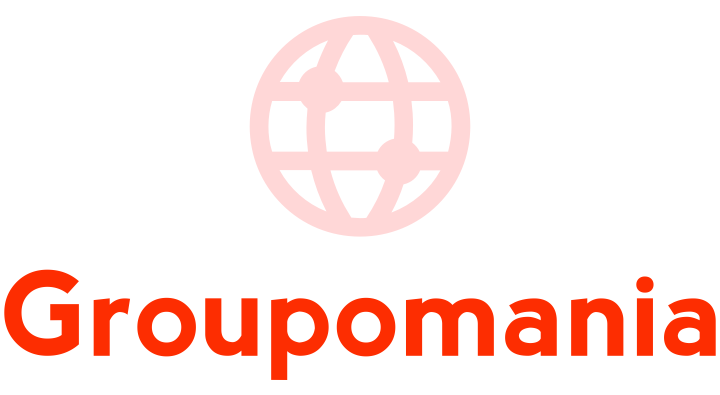

# Groupomania

Build Your Own Social Media Using Express, Hooks, & Postgres for the employees of **Groupomania**.

## What is PERN Stack?

This stack consists of **PostgreSQL, Express, React and Node.js**.

Combining these techs, one can build a full-stack web application with **CRUD** operations.

## Set up directory

The **Client** directory contains the React code.

The **Server** directory contains the code for the node.js express server.

cd into both Project Directories in 2 different terminal windows and then install the dependencies

#### 1st window

    cd Client
    npm install

#### 2nd window

    cd Server
    npm install

## Run both the server and client at the same time

#### 1st window

    npm start
    *** runs react at localhost:3000 ***

#### 2nd window

    npm run devstart
    *** devstart runs nodemon at localhost:5000 ***

## Contact the newbie

- [cheapskatePortfolio](https://git504.github.io/cheapskatePortfolio/ "card, FRONTEND REACT")
- [underdogFoto](https://git504.github.io/underdogF/ "card, FOTO")
